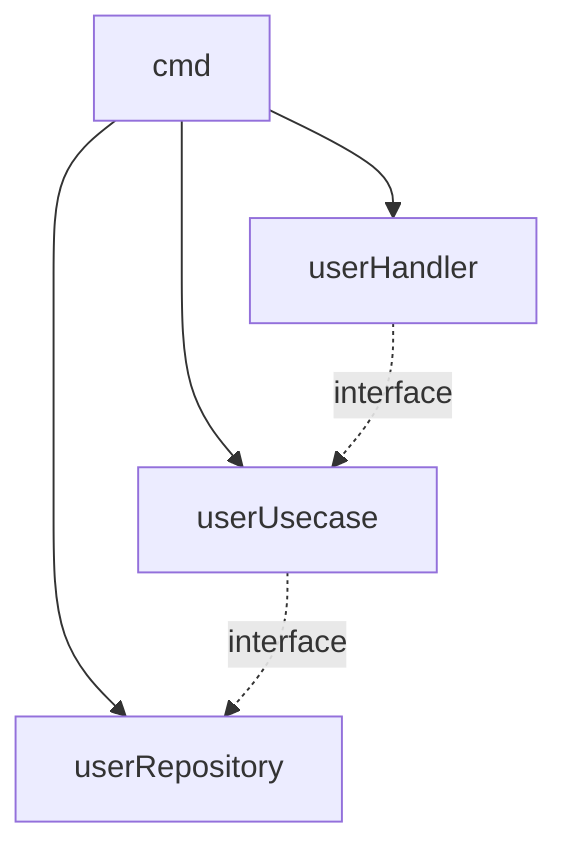

# restar

- cmd - здесь лежит main файл куда все импортируется
- pkg - здесь лежит вся структура кода
- pkg/domain - все сущности тут, может быть интерфейсы тоже
- pkg - папки здесь желательно называть именами сущностей, которыми они управляют, то есть папка user управляет 
- pkg/user
  - /handler.go - пример http хендлера
  - /usecase.go - пример бизнес логики, в хендлер импортируется через интерфейс
  - /repo.go - репозиторий, можно добавить, можно нет, импортируется бизнес логикой через интерфейс который надо описать в usecase либо в домене
- docs - документация
- configs - конфиги

- тут виндно что cmd зависит от всего, 
а пунктирными линиями показана зависимость через интерфейсы
то есть repo, usecase и handler не зависят друг от друга напрямую, а передаются в параметрах через интерфейс

пример графика
https://mermaid-js.github.io/mermaid/#/./flowchart?id=flowcharts-basic-syntax